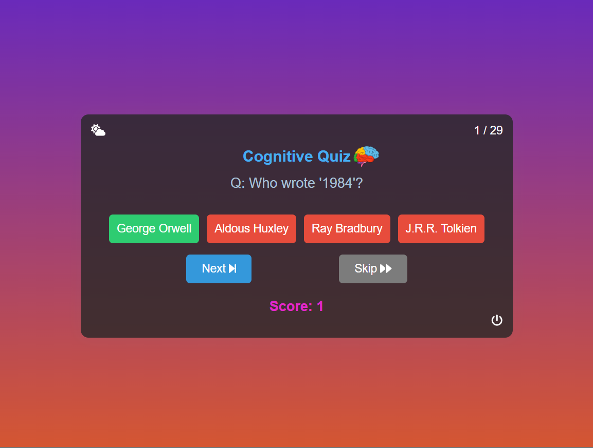
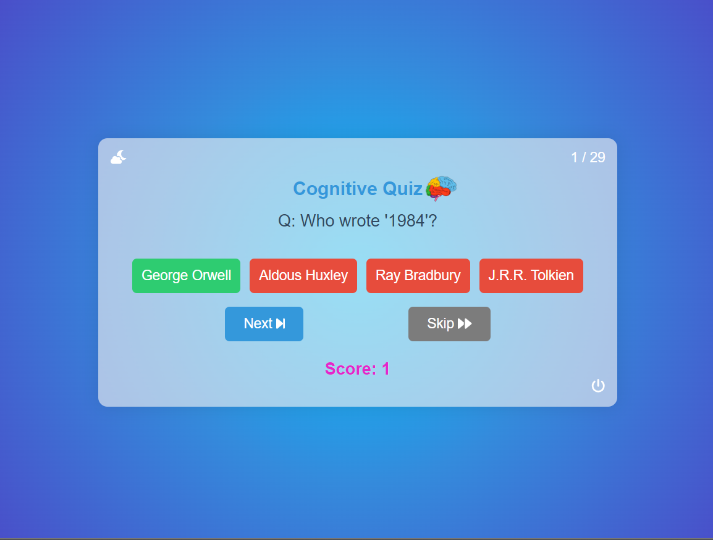

# Cogni Quiz 🧠

Welcome to Cogni Quiz, a web-based quiz application designed to challenge and enhance your cognitive abilities. This project covers a range of web development concepts and features an interactive quiz with dynamic questions, skip options, and a theme changer.

## Table of Contents

- [Screenshots](#screenshots)
- [Features](#features)
- [Installation](#installation)
- [Usage](#usage)
- [Contributing](#contributing)
- [License](#license)

## Screenshots
- 
- 

## Features

- **Interactive Quiz:** Engage in an interactive quiz with 80 handcrafted questions covering diverse topics.
- **Skip Questions:** Can't answer a question? Use the "Skip" feature to move forward.
- **Theme Changer:** Personalize your quiz experience with a theme switcher (light mode or dark mode).
- **User-Friendly Interface:** Enjoy a sleek and user-friendly design for a seamless quiz experience.

## Installation

1. Clone the repository:

   ```bash
   git clone https://github.com/cognisolevr/cogni-quiz.git
   ```

2. Open the project in your preferred code editor.

3. Launch the `index.html` file in your web browser.

## Usage

Follow these steps to explore and use the Cogni Quiz:

1. Open `index.html` in your browser.
2. Answer quiz questions, use the skip feature when needed.
3. Explore the theme changer for a personalized experience.
4. Enjoy the user-friendly interface and track your score.

## Contributing

Contributions are welcome! If you have ideas for improvements, new features, or find issues, feel free to open an issue or submit a pull request. Make sure to follow the [code of conduct](CODE_OF_CONDUCT.md).

## License

This project is licensed under the [MIT License](LICENSE).
